# Custom Dog Generator

## Table of Contents
- [Custom Dog Generator](#custom-dog-generator)
  - [Table of Contents](#table-of-contents)
  - [Overview](#overview)
    - [Features/Tools](#featurestools)
    - [Pages](#pages)
  - [Desktop View](#desktop-view)
  - [Mobile View](#mobile-view)

## Overview

> Visit Site: [custom-portrait-app.firebaseapp.com](https://custom-portrait-app.firebaseapp.com/)

Users can generate their own dogs using Pizzapup illustration assets by completing a multi-step customization/personalization form. All dogs are displayed in the gallery where users are able to view details for each dog and add/update accessories. 

### Features/Tools

<a href="#table-of-contents">back to top</a>

- React.js - [react.dev](https://react.dev/)
- React Router - [reactrouter.com](https://reactrouter.com/en/main) | [`lazy`](https://reactrouter.com/en/main/route/lazy)
- Firebase - [hosting](https://firebase.google.com/docs/hosting) | [realtime database](https://firebase.google.com/docs/database)
- SCSS + CSS variables for dynamic styles
- Hex to Color Name Feature - color input is processed into the nearest matching color name
- [React Toastify](https://www.npmjs.com/package/react-toastify)
- [Emotion](https://emotion.sh/docs/introduction)
- All assets designed and developed by Pizzapup

___
### Pages 

<a href="#table-of-contents">back to top</a>

- Home
- Create Dog (Form)
- Gallery (View cards)
- Details (View dog details)

<h4 id="form-steps">Form Step Descriptions</h4>

- About
  - Name
  - Favorite Toy
  - Description
- Body
  - Body Type
    - Regular: average build
    - Medium: frequents the cookie jar
    - Chonky: devoured the cookie jar
  - Body Color
    - Coat color: select the dominant color for your dog's coat
- Eyes
  - Eye Type
    - Squint: Could be due to allergies ... but most likely these eyes are judging you
    - Round: Big eyes
    - Closed: Universal, sweet, pure
  - Eye Color
    - Available with certain eye types (can't see when they are closed!)
- Snout
  - Nose
    - Long: The classic dog snout
    - Button: Lil button nose
    - Heart: Similar to button but for the extra sweet pups
  - Mouth
    - Smile: happy pup
    - Straight: Normal. Or, again, possibly judging you
    - Tongue: For the goofballs & the ones that just cant help it (pug parents and senior dog owners know whats up)

___

## Desktop View

<a href="#table-of-contents">back to top</a>

 
Screens under 640px wide

| [Home](#home-d)                                                     | [Form](#form-d)                                                     | [Gallery](#gallery-d)                                                  | [Details](#details-d)                                                   |
|---------------------------------------------------------------------|---------------------------------------------------------------------|------------------------------------------------------------------------|-------------------------------------------------------------------------|
| 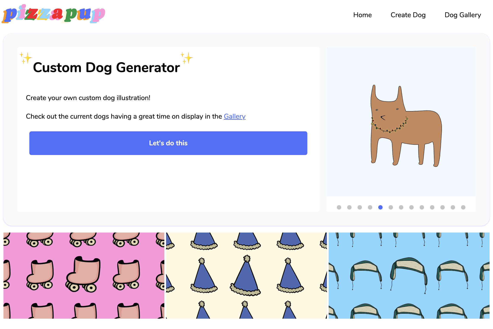 | 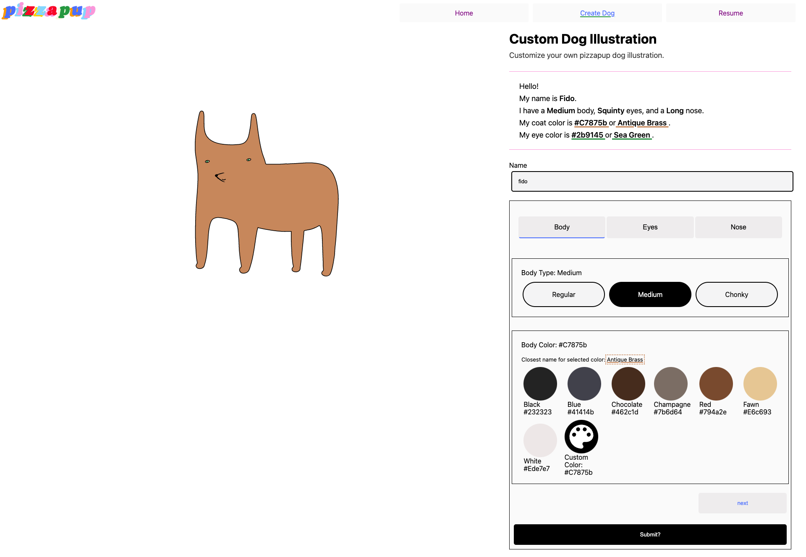 | 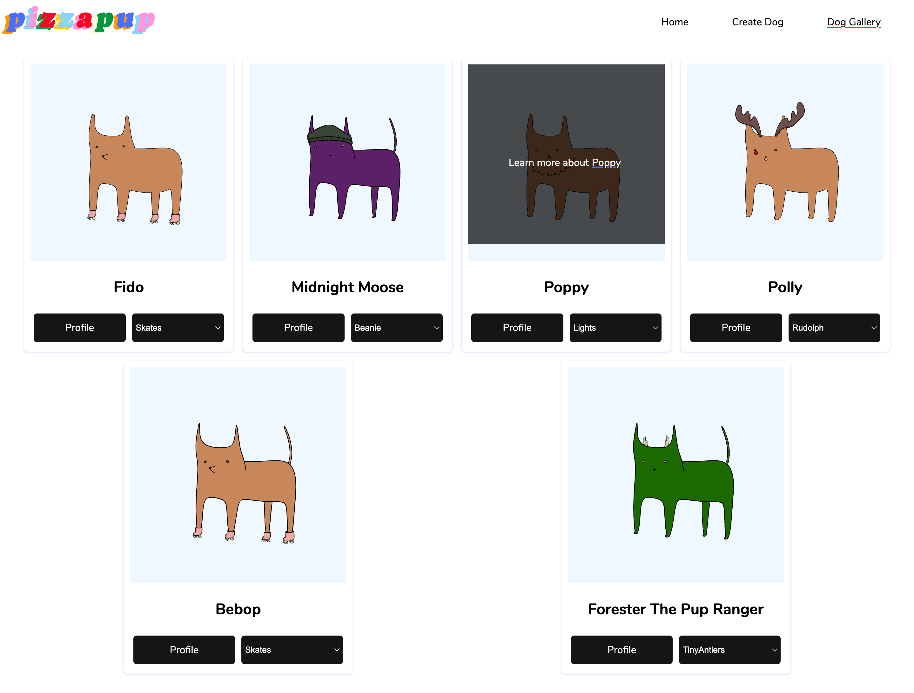 | 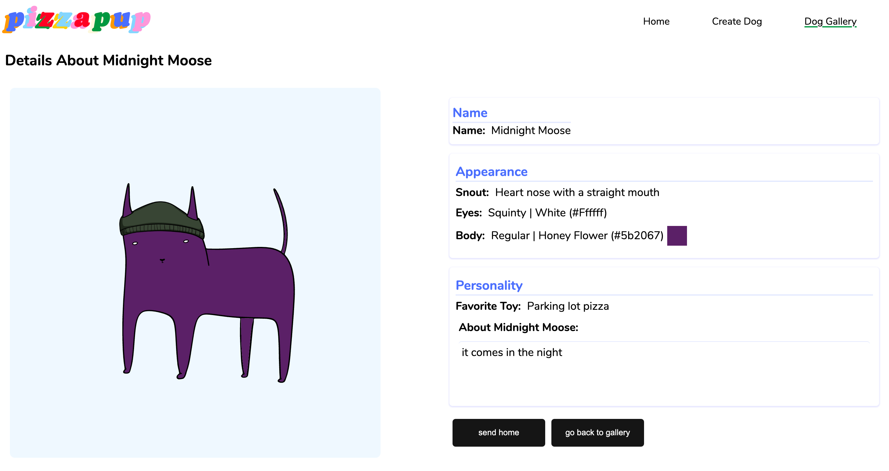 |

| [About](#about-d)                                                   | [Body](#body-d)                                                     | [Eyes](#eyes-d)                                                     | [Snout](#snout-d)                                                     |
|---------------------------------------------------------------------|---------------------------------------------------------------------|---------------------------------------------------------------------|-----------------------------------------------------------------------|
| 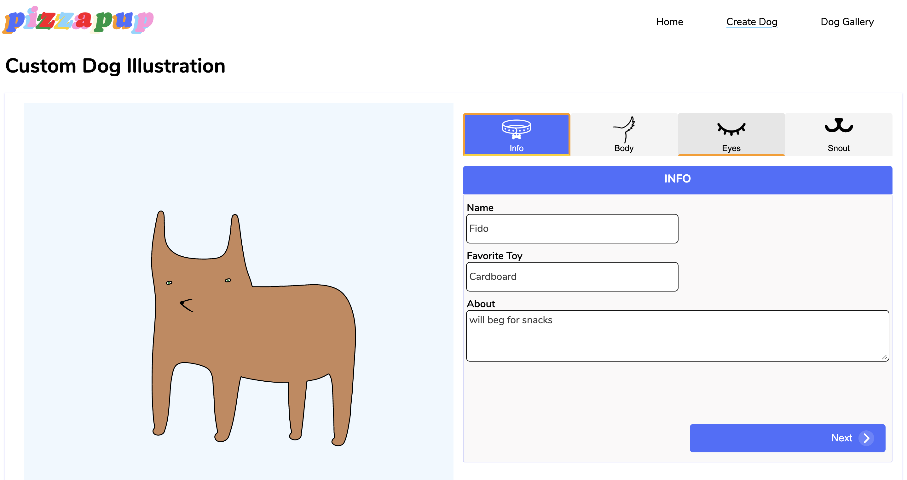 |  | 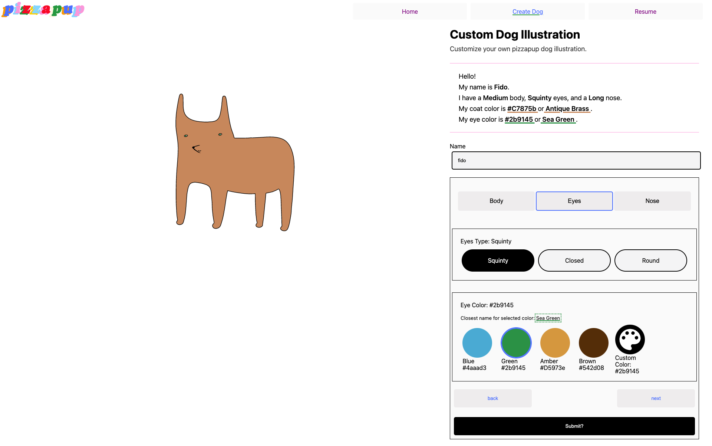 | 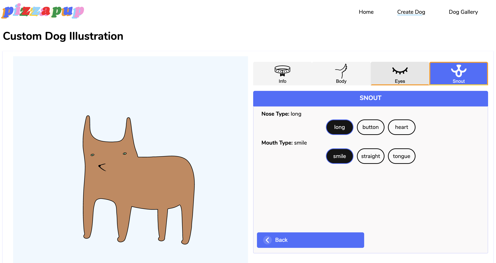 |
___

 

## Mobile View 
 

<a href="#table-of-contents">back to top</a>

Screens under 640px wide

| [Home](#home-m)                                                    | [Form](#form-m)                                                    | [Gallery](#gallery-m)                                                 | [Details](#details-m)                                                  |
|--------------------------------------------------------------------|--------------------------------------------------------------------|-----------------------------------------------------------------------|------------------------------------------------------------------------|
| 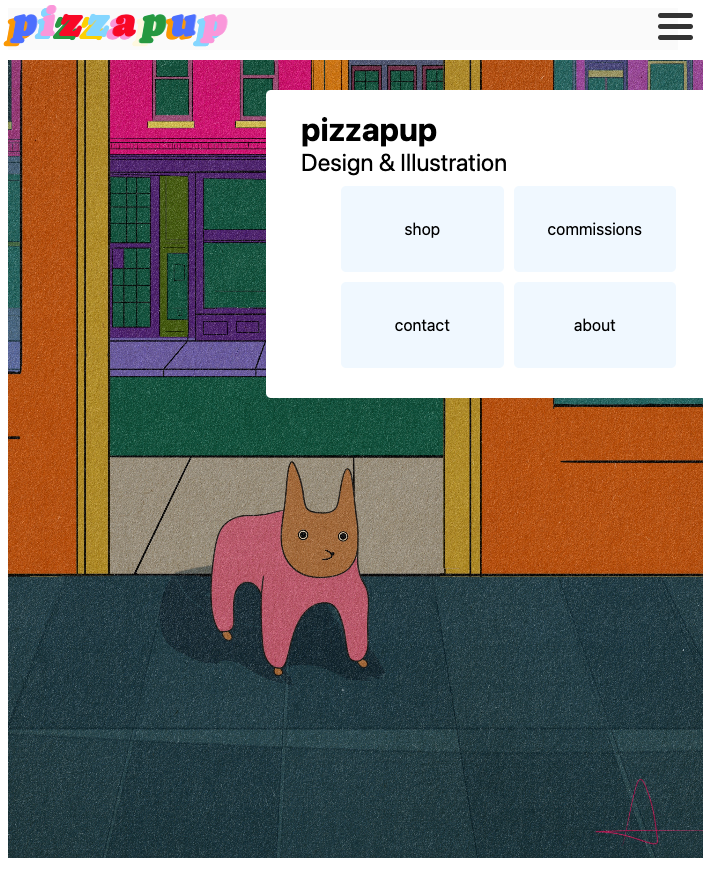 | 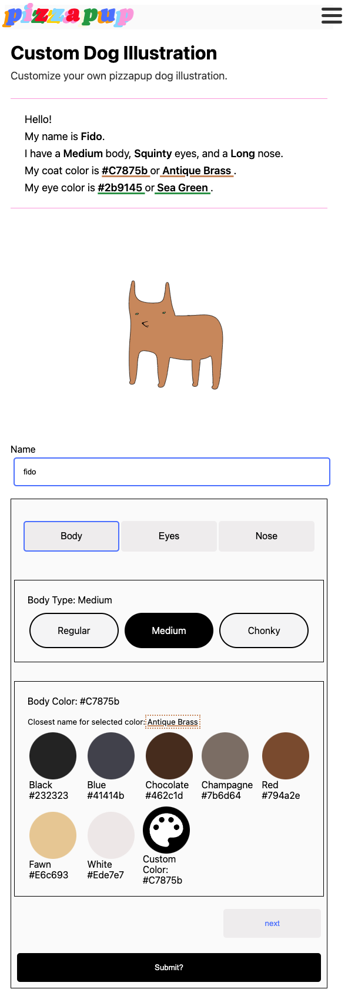 | 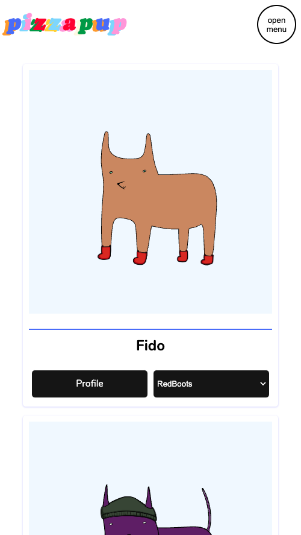 | 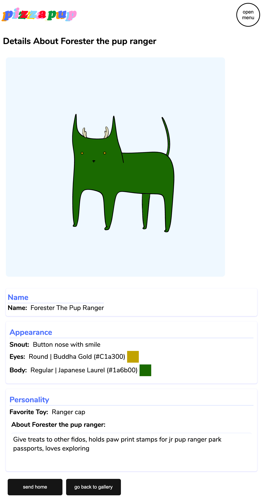 |

| [About](#about-m)                                                  | [Body](#body-m)                                                    | [Eyes](#eyes-m)                                                    | [Snout](#snout-m)                                                    |
|--------------------------------------------------------------------|--------------------------------------------------------------------|--------------------------------------------------------------------|----------------------------------------------------------------------|
| 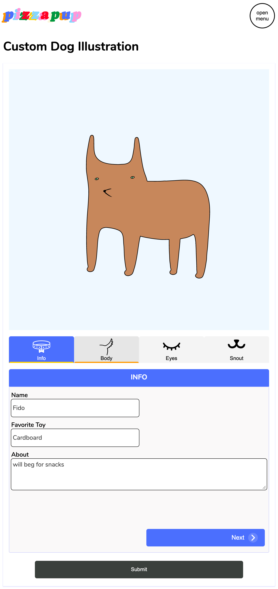 |  |  | 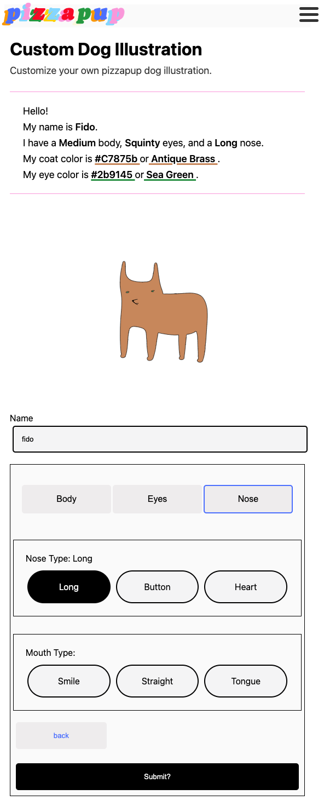 |

