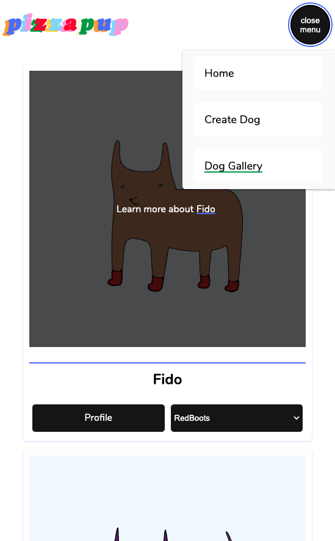
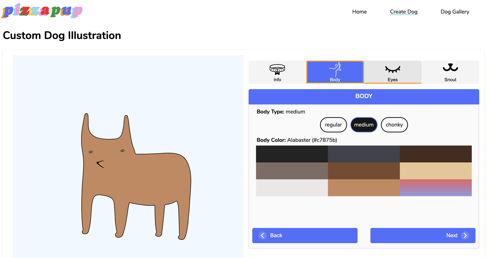
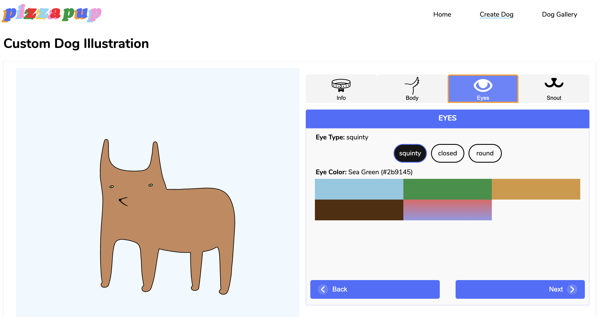
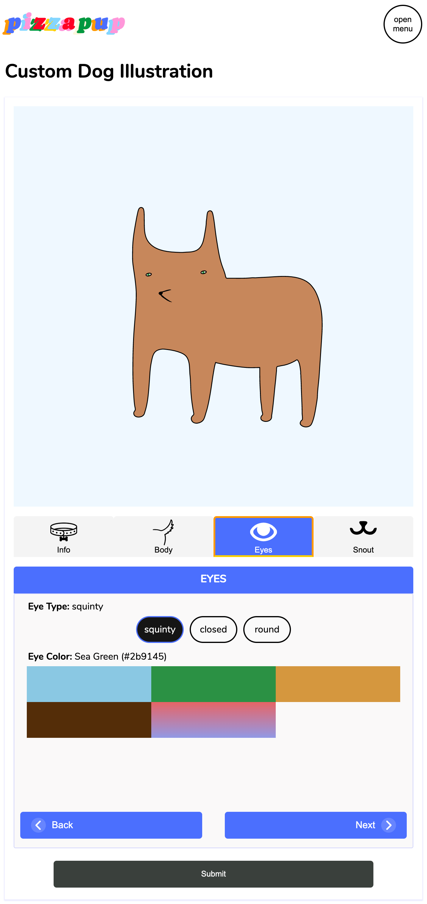
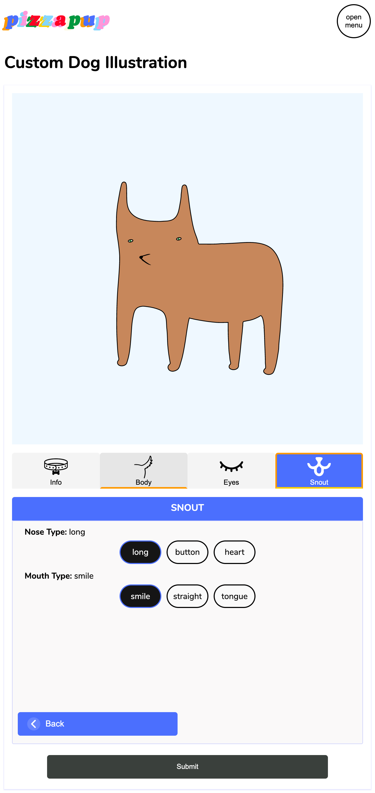

# Custom Portrait App (custom-portrait-app)

## Table of Contents
- [Custom Portrait App (custom-portrait-app)](#custom-portrait-app-custom-portrait-app)
  - [Table of Contents](#table-of-contents)
  - [About](#about)
  - [Features/Tools](#featurestools)
  - [Pages](#pages)
    - [Home](#home)
      - [Home | Desktop View](#home--desktop-view)
      - [Home | Mobile View](#home--mobile-view)
      - [Open Mobile Navigation Menu](#open-mobile-navigation-menu)
    - [Customize Dog Form](#customize-dog-form)
      - [Features](#features)
      - [Steps](#steps)
        - [Body Type \& Coat Color | Desktop View](#body-type--coat-color--desktop-view)
        - [Eye Type \& Color | Desktop View](#eye-type--color--desktop-view)
        - [Snout: Nose \& Mouth | Desktop View](#snout-nose--mouth--desktop-view)
        - [Body Type \& Coat Color | Mobile View](#body-type--coat-color--mobile-view)
        - [Eye Type \& Color | Mobile View](#eye-type--color--mobile-view)
        - [Snout: Nose \& Mouth | Mobile View](#snout-nose--mouth--mobile-view)
    - [Resume](#resume)

## About

> Visit Site: [custom-portrait-app.firebaseapp.com](https://custom-portrait-app.firebaseapp.com/createdog)

Generate your own custom pizzapup dog illustration. Choose the type of body, eyes, nose, and mouth for your pup. Choose from a curated collection of eye and coat colors, or create your own! 

## Features/Tools
- React.js - Open-source front-end JavaScript library | [React.dev](https://react.dev/)
- React Router - Enables client-side routing | [reactrouter.com](https://reactrouter.com/en/main)
  - Code-splitting 
    - Lazy loading - Design pattern used to increase applications performance by reducing initial loading time. 
      - [`lazy`](https://reactrouter.com/en/main/route/lazy) - reactrouter.com
      - [The Benefits of Lazy Loading](https://www.imperva.com/learn/performance/lazy-loading/#:~:text=The%20benefits%20of%20lazy%20loading,users%20only%20if%20it's%20requested.) - imperva.com
- Firebase
  - Hosting - application uses firebase hosting. [firebase hosting docs](https://firebase.google.com/docs/hosting)
  - Realtime database - data for application is stored in firebase realtime database. Data submitted through the create-dog-form is stored in firebase. [realtime database docs](https://firebase.google.com/docs/database)
- CSS - good ol classic css

## Pages

### Home

| Home (Desktop)                                                     | Home (Mobile)                                                    | Mobile Nav Menu                                                      |
| ------------------------------------------------------------------ | ---------------------------------------------------------------- | -------------------------------------------------------------------- |
|  |  |  |

Home Page

#### Home | Desktop View

#### Home | Mobile View

#### Open Mobile Navigation Menu

### Customize Dog Form

#### Features

Choose from a collection of dog coat and eye colors based on colors found in various dog breeds. 
- HexColorToColorName | [GitHub Repository](https://github.com/jeff3754/HexColorToColorName#readme)

#### Steps

| [Body](#body-type--coat-color)                                      | [Eyes](#eye-type--color)                                            | [Snout](#snout-nose--mouth)                                           |
| ------------------------------------------------------------------- | ------------------------------------------------------------------- | --------------------------------------------------------------------- |
|  |  |  |

Desktop View

| [Body](#body-type--coat-color)                                      | [Eyes](#eye-type--color)                                            | [Snout](#snout-nose--mouth)                                           |
| ------------------------------------------------------------------- | ------------------------------------------------------------------- | --------------------------------------------------------------------- |
|  |  |  |

##### Body Type & Coat Color | Desktop View
<!--  -->

##### Eye Type & Color | Desktop View

##### Snout: Nose & Mouth | Desktop View

Mobile View

| [Body](#body-type--coat-color)                                     | [Eyes](#eye-type--coat-color)                                      | [Snout](#snout-nose--mouth)                                          |
| ------------------------------------------------------------------ | ------------------------------------------------------------------ | -------------------------------------------------------------------- |
|  |  |  |

##### Body Type & Coat Color | Mobile View
<!--  -->

##### Eye Type & Color | Mobile View

##### Snout: Nose & Mouth | Mobile View

### Resume

Design based off of resume PDF. Download the [original resume PDF](preview-imgs/Hardwick-2022.pdf)

<!-- #### Resume Desktop View -->

<h4>Resume Desktop View</h4>

<!-- #### Resume Mobile View -->

<h4>Resume Mobile View</h4>

