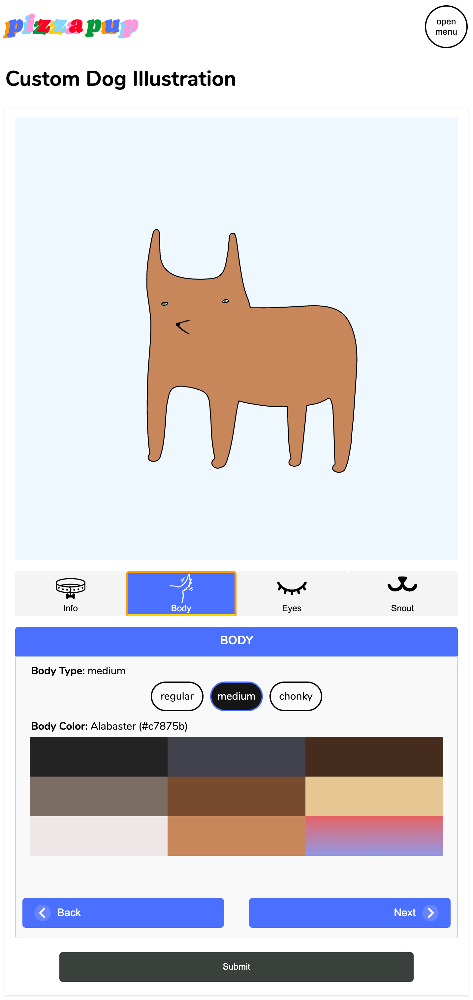

# Custom Dog Generator (custom-dog-generator)

## Table of Contents
- [About](#about)
- [Features/Tools](#featurestools)
- [Pages](#pages)
    - [Home](#home)
        - Home [Desktop](#home--desktop-view) | [Mobile](#home--mobile-view) 
        - [Mobile Navigation Menu](#open-mobile-navigation-menu)
    - [Custom Dog Generator](#customize-dog-form)
        - [Features](#features)
        - [Steps](#steps)
          - Body Type \& Coat Color [Desktop](#body-type--coat-color--desktop-view) | [Mobile](#body-type--coat-color--mobile-view)
          - Eye Type \& Color [Desktop](#eye-type--color--desktop-view) | [Mobile](#body-type--coat-color--mobile-view)
          - Snout: Nose \& Mouth [Desktop](#snout-nose--mouth--desktop-view) | [Mobile](#body-type--coat-color--mobile-view)
    - [Resume](#resume)

## About

> Visit Site: [custom-portrait-app.firebaseapp.com](https://custom-portrait-app.firebaseapp.com/createdog)

Generate your own custom pizzapup dog illustration. Choose the type of body, eyes, nose, and mouth for your pup. Choose from a curated collection of eye and coat colors, or create your own! 

## Features/Tools

<a href="#table-of-contents">back to top</a>

- React.js - Open-source front-end JavaScript library | [React.dev](https://react.dev/)
- React Router - Enables client-side routing | [reactrouter.com](https://reactrouter.com/en/main)
  - Code-splitting 
    - Lazy loading - Design pattern used to increase applications performance by reducing initial loading time. 
      - [`lazy`](https://reactrouter.com/en/main/route/lazy) - reactrouter.com
      - [The Benefits of Lazy Loading](https://www.imperva.com/learn/performance/lazy-loading/#:~:text=The%20benefits%20of%20lazy%20loading,users%20only%20if%20it's%20requested.) - imperva.com
- Firebase
  - Hosting - application uses firebase hosting. [firebase hosting docs](https://firebase.google.com/docs/hosting)
  - Realtime database - data for application is stored in firebase realtime database. Data submitted through the create-dog-form is stored in firebase. [realtime database docs](https://firebase.google.com/docs/database)
- CSS - good ol classic css
- Color Name Generator - color input is processed into the nearest matching color name (#ffffff = white) 

## Pages 

<a href="#table-of-contents">back to top</a>

### Home 

<a href="#table-of-contents">back to top</a>

| Home (Desktop)                                                     | Home (Mobile)                                                    | Mobile Nav Menu                                                      |
| ------------------------------------------------------------------ | ---------------------------------------------------------------- | -------------------------------------------------------------------- |
|  |  |  |

#### Home | Desktop View

<a href="#table-of-contents">back to top</a>

#### Home | Mobile View

<a href="#table-of-contents">back to top</a>

#### Open Mobile Navigation Menu

<a href="#table-of-contents">back to top</a>

### Customize Dog Form

<a href="#table-of-contents">back to top</a>

#### Features

<a href="#table-of-contents">back to top</a>

Choose from a collection of dog coat and eye colors based on colors found in various dog breeds, or create your own using the color picker. Color names are generated using the hex code of the selected color. The function that finds the name is based on the HexColorToColorName repository. 
- HexColorToColorName | [GitHub Repository](https://github.com/jeff3754/HexColorToColorName#readme)

#### Steps

<a href="#table-of-contents">back to top</a>

| [Body](#body-type--coat-color)                                      | [Eyes](#eye-type--color)                                            | [Snout](#snout-nose--mouth)                                           |
| ------------------------------------------------------------------- | ------------------------------------------------------------------- | --------------------------------------------------------------------- |
|  |  |  |

#### Desktop View

<a href="#table-of-contents">back to top</a>

| [Body](#body-type--coat-color)                                      | [Eyes](#eye-type--color)                                            | [Snout](#snout-nose--mouth)                                           |
| ------------------------------------------------------------------- | ------------------------------------------------------------------- | --------------------------------------------------------------------- |
|  |  |  |

##### Body Type & Coat Color | Desktop View

<a href="#table-of-contents">back to top</a>

##### Eye Type & Color | Desktop View

<a href="#table-of-contents">back to top</a>

##### Snout: Nose & Mouth | Desktop View

<a href="#table-of-contents">back to top</a>

#### Mobile View

<a href="#table-of-contents">back to top</a>

| [Body](#body-type--coat-color)                                     | [Eyes](#eye-type--coat-color)                                      | [Snout](#snout-nose--mouth)                                          |
| ------------------------------------------------------------------ | ------------------------------------------------------------------ | -------------------------------------------------------------------- |
|  |  |  |

##### Body Type & Coat Color | Mobile View

<a href="#table-of-contents">back to top</a>

##### Eye Type & Color | Mobile View

<a href="#table-of-contents">back to top</a>

##### Snout: Nose & Mouth | Mobile View

<a href="#table-of-contents">back to top</a>

### Resume

<a href="#table-of-contents">back to top</a>

Design based off of resume PDF. Download the [original resume PDF](preview-imgs/Hardwick-2022.pdf)

<!-- #### Resume Desktop View -->

#### Resume Desktop View

<a href="#table-of-contents">back to top</a>

<!-- #### Resume Mobile View -->

#### Resume Mobile View

<a href="#table-of-contents">back to top</a>

