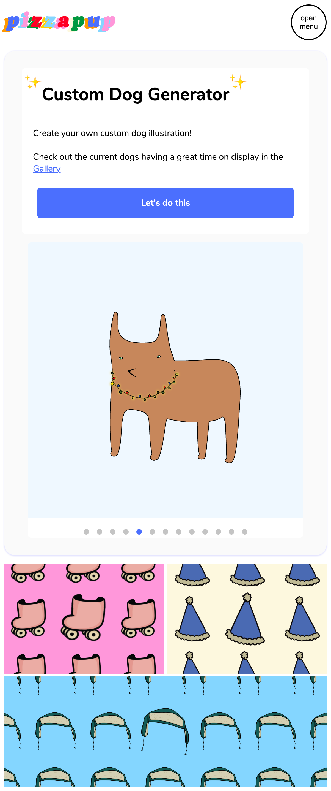

# Pizzapup Dev App (pizzapup-dev-app)

## Table of Contents
- [Pizzapup Dev App (pizzapup-dev-app)](#pizzapup-dev-app-pizzapup-dev-app)
  - [Table of Contents](#table-of-contents)
  - [About](#about)
  - [Features/Tools](#featurestools)
  - [Pages](#pages)
    - [Home](#home)
      - [Home Desktop View](#home-desktop-view)
      - [Home Mobile View](#home-mobile-view)
      - [Open Mobile Navigation Menu](#open-mobile-navigation-menu)
    - [Customize Dog](#customize-dog)
      - [Form Steps](#form-steps)
        - [Body Type \& Coat Color](#body-type--coat-color)
        - [Eye Type \& Color](#eye-type--color)
        - [Snout: Nose \& Mouth](#snout-nose--mouth)
      - [Form Features](#form-features)
    - [Resume](#resume)
      - [Resume Desktop View](#resume-desktop-view)
      - [Resume Mobile View](#resume-mobile-view)

## About

> Visit Site: 

## Features/Tools
- React.js - Open-source front-end JavaScript library | [React.dev](https://react.dev/)
- React Router - Enables client-side routing | [reactrouter.com](https://reactrouter.com/en/main)
  - Lazy loading
- Firebase
- CSS

## Pages

### Home

#### Home Desktop View

#### Home Mobile View

#### Open Mobile Navigation Menu

### Customize Dog

#### Form Steps

| [Body](#body-type--coat-color)                                  | [Eyes](#eye-type--coat-color)                                   | [Snout](#snout-nose--mouth)                                      |
| --------------------------------------------------------------- | --------------------------------------------------------------- | ---------------------------------------------------------------- |
|  |  |  |

##### Body Type & Coat Color

##### Eye Type & Color

##### Snout: Nose & Mouth

#### Form Features
- HexColorToColorName | [GitHub Repository](https://github.com/jeff3754/HexColorToColorName#readme)

### Resume

Design based off of resume PDF. Download the [original resume PDF](preview-imgs/Hardwick-2022.pdf)

#### Resume Desktop View

#### Resume Mobile View

